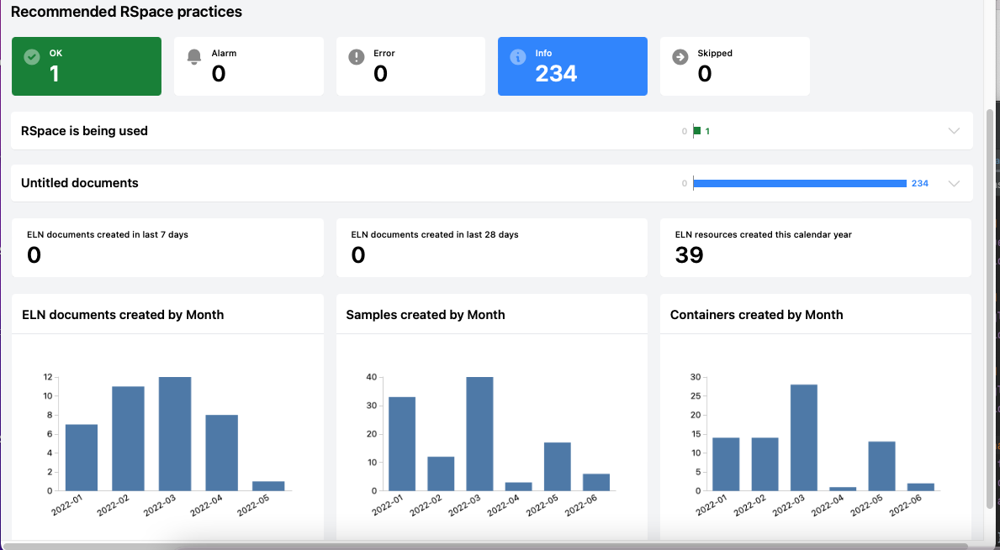

Steampipe plugin for RSpace ELN

This plugin provides some access to RSpave resources via the activity/ and documents/ API using  [Steampipe](https://steampipe.io) 

A Docker image with embedded RSpace dashboard is available:

To run the Dashboard, get the image

    docker pull otter606/rspace-steampipe:0.0.1

Set an API key and URL for your RSpace in environment variables, e.g.

    export RSPACE_API_KEY="abcdefg"
    export RSPACE_URL=https://path/to/yourRSpace/

Note the trailing / is required on the URL.

### Basic command to launch dashboard

To run the dashboard:

    docker run --rm  --name rspace-dashboard -p9194:9194 -eRSPACE_API_KEY -e RSPACE_URL otter606/rspace-steampipe:0.0.1 

And open your browser at http://localhost:9194/local.dashboard.rspace_dashboard

You should see a dashboard illustrating some stats about RSpace activity. The 'Untitled documents' benchmark can take some time to load.

The Dashboard can show charts, tables and alerts.
The above command will stop remove the Docker container when you stop it using Ctrl-C.

### Running queries

You can run the container as a long-running process:

    docker run -d  --name rspace-dashboard -p9194:9194 -eRSPACE_API_KEY -eRSPACE_URL otter606/rspace-steampipe:0.0.1

and then access the Steampipe query command line to execute arbitrary queries:

    docker exec -it rspace-dashboard steampipe query 

    > select timestamp, payload->>'name' from rspace_event where domain='RECORD' and action='CREATE' and username='bbayham';

Currently only 'AND' is handled and only one domain, action or username can be passed in as an argument.

### Getting reports in CSV format

You can pass in a query on the command line and specify an output format (csv or json):

    docker exec -it rspace-dashboard steampipe query\
     "select timestamp, payload->>'name' as name, payload ->>'id' as id from rspace_event where domain='RECORD' and action='CREATE'" --output csv

Please suggest any information you'd like to see in the dashboard. 

    
